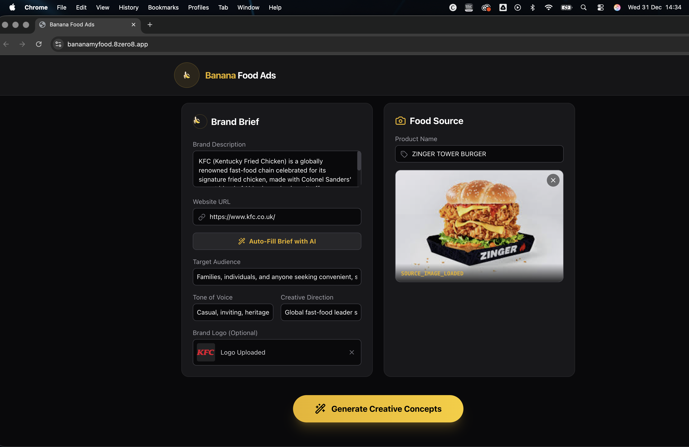
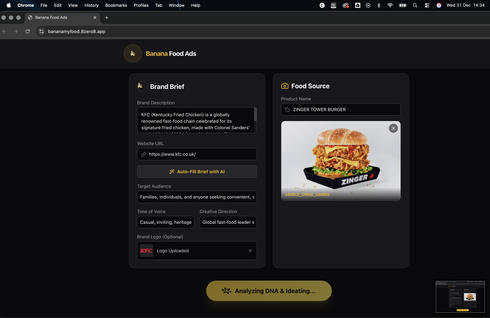
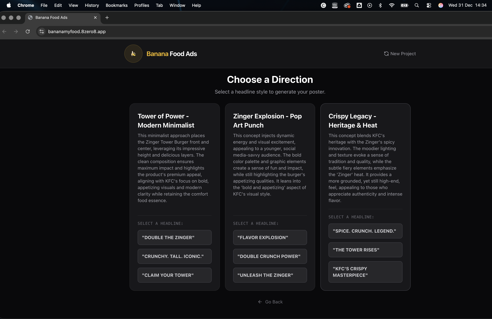
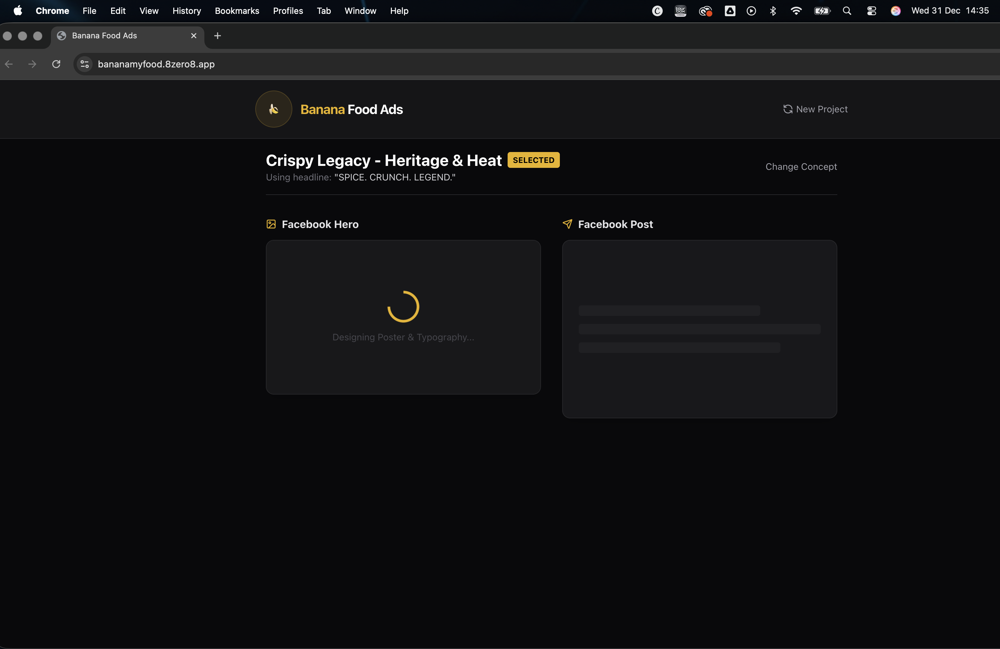
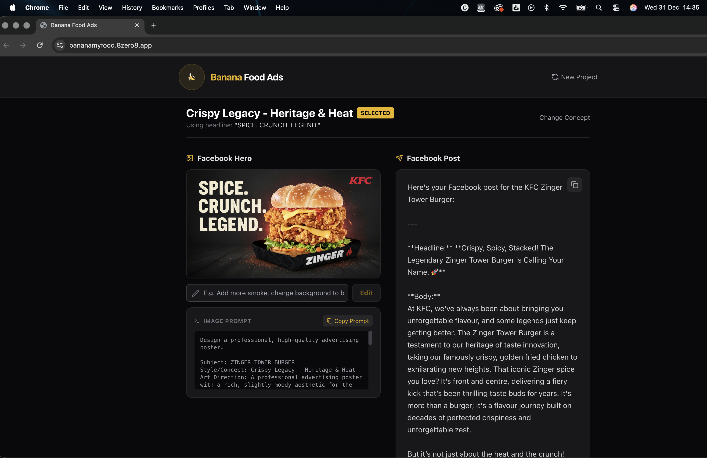

# Banana my food socials 🍌🍕

**Banana my food socials** is an AI-powered marketing assistant designed specifically for food brands. It takes raw food photography and brand details to generate high-end, captivating Facebook hero images and engaging post copy.

It leverages Google's **Gemini 2.5 Flash** models to provide a completely free-tier compatible experience without sacrificing quality.

## ✨ Features

- **🔎 Smart Brand Research (Grounding)**: Uses **Google Search** grounding to automatically research your brand from a URL, inferring audience, tone, and even finding your logo on the web.
- **🧬 Deep Brand DNA**: Analyzes your inputs to extract visual style, tone of voice, and key themes. Now supports granular manual overrides for Target Audience, Tone, and Creative Direction.
- **📸 Image Capture & Analysis**: Upload existing photos or capture fresh food shots directly from your device.
- **🧠 Granular Creative Direction**: Generates 3 distinct creative concepts. For each concept, it provides **3 selectable Headlines/CTAs**, allowing you to choose the exact angle for your ad.
- **🎨 AI Typography & Logo Integration**: Unlike basic overlays, this app uses `gemini-2.5-flash-image` to **render text and logos directly into the pixels** of the image for professional, magazine-quality typography and composition.
- **🪄 Conversational Image Editing**: Not happy with the result? Type instructions like "add more steam" or "change background to neon" to refine the image instantly.
- **✍️ Copywriting**: Writes engaging Facebook post content, including headlines, body copy, and hashtags that match your brand's voice.
- **💸 Free Tier Optimized**: Built entirely using Gemini 1.5/2.5 Flash models to ensure low latency and zero cost on the free tier.

## 🚀 Getting Started

### Prerequisites

1.  **Node.js**: Ensure you have Node.js installed (v18+ recommended).
2.  **Google Gemini API Key**: You need an API key from [Google AI Studio](https://aistudio.google.com/app/apikey).
    *   *Note: This app uses the paid-tier-capable API endpoints but works perfectly with the Free plan.*

### Installation

1.  **Clone the repository** (or download the files):
    ```bash
    git clone https://github.com/your-username/banana-my-food-socials.git
    cd banana-my-food-socials
    ```

2.  **Install dependencies**:
    ```bash
    npm install
    ```

3.  **Start the development server**:
    ```bash
    npm start
    # or if using Vite:
    npm run dev
    ```

### Configuration

The application requires a Google Gemini API Key. You have two options:

1.  **Environment Variable (Recommended for Dev)**: Create a `.env` file in the root directory:
    ```env
    API_KEY=your_google_api_key_here
    ```
2.  **In-App Selection**: If no environment variable is found, the app will prompt you to securely select/connect your API key via the Google AI Studio integration upon launch.

## 📖 How to Use

1.  **Define Brand DNA**:
    *   Enter your website URL and click **"Auto-Fill Brief with AI"**. The app will search Google to fill in your brand description, audience, tone, and attempt to fetch your logo.
    *   (Optional) Fine-tune the "Target Audience", "Tone", and "Creative Direction" fields manually.
2.  **Add Food Source**:
    *   Upload a photo of your dish or take a picture using your device's camera.
    *   Give your product a name (e.g., "The Truffle Smash").
3.  **Generate Concepts**:
    *   Click **"Generate Creative Concepts"**. The AI will propose 3 unique art directions.
4.  **Select Direction**:
    *   Review the concepts. Each concept offers **3 distinct Headlines**.
    *   Click the specific Headline (CTA) you want to use.
5.  **Refine & Download**:
    *   The app generates a high-definition Hero Image with the chosen headline baked into the design.
    *   Use the **Edit** box to tweak the image (e.g., "Make the lighting moodier").
    *   Click **"Download Poster"** to save your asset.

## 📸 Workflow

| Step 1: Input Brand & Food | Step 2: AI Analysis | Step 3: Choose Direction |
|:---:|:---:|:---:|
|  |  |  |
| **Auto-fill brief & upload photo** | **Analyzing DNA & Ideating** | **Select a creative concept** |

| Step 4: Generation | Step 5: Final Result |
|:---:|:---:|
|  |  |
| **Designing Poster & Typography** | **High-res Social Media Hero** |

## 🛠️ Tech Stack

- **Frontend**: React 19, TypeScript
- **Styling**: Tailwind CSS
- **Icons**: Lucide React
- **AI**: @google/genai SDK (Gemini 2.5 Flash & Flash Image)
- **Tools**: Google Search Grounding
- **Build**: Vite (recommended) or Parcel

## 📄 License

MIT License. Feel free to fork and modify for your own food adventures!